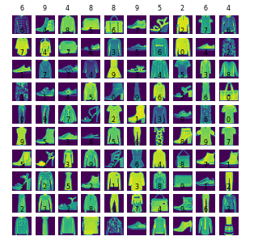
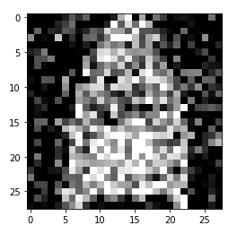
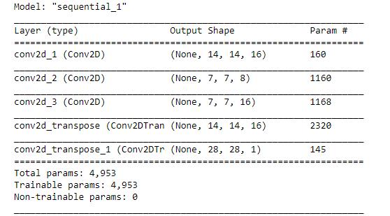
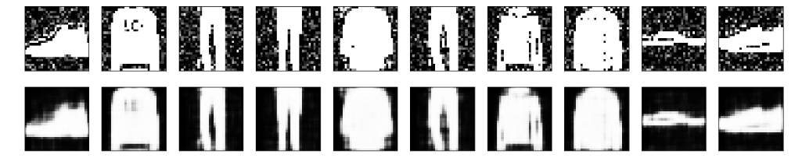

# Image-Denoising-using-AutoEncoders
It uese a Database of Images adds Noise and Then Removes it and Compares the Result, using an Auto Encoder
It works With Tenser Flowas the Backend.All The Operation are done on Gray Scale Image with Single Channel.

# Screenshots

    This Image Shows a Grid of 10x10 Images, we will be working on 

    This image is the After Result of the Original image when ran with a Noise Adder we can set a Noise Factor for Increasing or Decreasing the Amount of noise in a Image.

    This Image shows the Layers of Filters used in the Model for Training. Thr first 3 Layers are doing Convolution and Reducing the Image size, This Process is Encoding, The Other 2 Layers are Doing Transpose of the Convolution,  to get back the Original Image Without the Noise. This Process is called Decoding.

  This image is the Final Result of the Program, The First Layer shows the input Image with  noise and the Secont Layer Shows the Decoded Image with Removed Noise.

